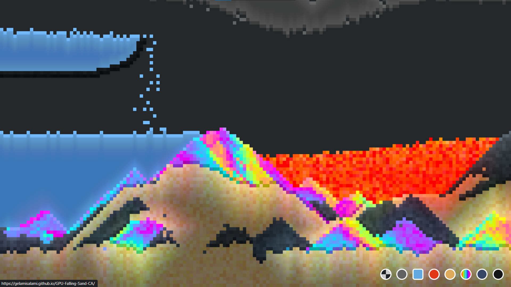

# GPU Falling Sand Cellular Automata

GPU Falling sand simulation using block cellular automata with Margolus offsets  
https://gelamisalami.github.io/GPU-Falling-Sand-CA/

One problem in implementing a falling sand simulation in the GPU is avoiding race conditions, where two cells would try to move into the same place at the same time. We circumvent that problem by using block cellular automata.
Block cellular automata divides cells into non-overlapping blocks, where cells in each block are processed as a whole simultaneously. This makes the algorithm easily parallelizable for the GPU.  
The simplest way to do that is using the Magolus neighborhood, in which each block is sized 2x2 and shifted by one cell diagonally (in both dimensions) in alternate timesteps.

One difference we have with block cellular automata is that cells are **swapped** with each other, instead of processing them as a whole block. This makes it easier to add multiple types of materials and extend to have different behaviors and properties.

Another difference we have is that the neighborhood is shifted in 4 steps in a z-shaped curve to prevent bias that happens in the original 2-step diagonal shift.[^1]

Dynamic 2D lighting done using the jump flooding algorithm (JFA)[^2] with a Manhattan distance metric to simulate tile-based lighting. To add colored lighting, we do the JFA once for each RGB channel, and store RGB offsets in the seed pixels which offsets the attenuation of the light for each RGB channel.

[^1]: [Probabilistic Cellular Automata for Granular Media in Video Games](https://arxiv.org/abs/2008.06341)
[^2]: [Jump flooding algorithm - Wikipedia](https://wikipedia.org/wiki/Jump_flooding_algorithm)